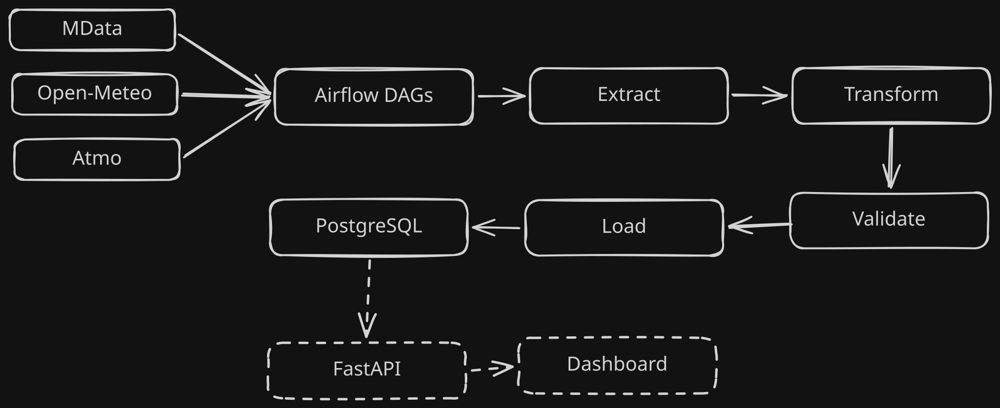

# M-Tram
Daily ETL pipeline that collects, validates and stores **139k+ rows/day** from three Grenoble public APIs: traffic from Mobilités M, air quality from Atmo Auvergne-Rhône-Alpes, and weather from Open-Meteo. The pipeline is orchestrated by Airflow and stores historical time series in PostgreSQL.

**Stack:** Airflow with Celery · Python · PostgreSQL · SQLAlchemy · Alembic · Pydantic · Docker Compose · GitHub Actions · pytest

## Architecture

MData / Open-Meteo / ATMO AuRA → Airflow DAGs → extract → transform → validate → load → PostgreSQL → [FastAPI](docs/api.md)

The ETL layer normalizes each API payload into pandas DataFrames, validates the resulting records with Pydantic schemas, and persists them through SQLAlchemy. The current workflows cover traffic (`trr` and `ligne`), weather (`openmeteo`), and air quality (`atmo`).

## Data validation
- Pydantic schemas check required fields, Python types, allowed values, realistic ranges, empty inputs, and duplicate primary keys for each dataset.
- The transform layer removes unusable source records, such as traffic observations with an `nsv_id` of `0`, and skips structurally incomplete records while processing API payloads.
- A validation error raises an exception and fails the Airflow task before anything is inserted into PostgreSQL.
- Inserts use PostgreSQL conflict handling so records already present for the same primary key are not duplicated. Transform and task errors are available in the Airflow task logs under `airflow/logs/` and in the Airflow UI.

## Deployment
GitHub Actions runs the unit/integration tests and Airflow DAG tests on every push and pull request. The project is packaged and run with Docker Compose, which orchestrates PostgreSQL, Redis, the Airflow API server, scheduler, DAG processor, workers, and triggerer. The VPS deployment is operated with the repository's Docker Compose scripts.

## API
The project includes a functional FastAPI V1 that provides simple read-only access to the stored data:
- `/count` returns the number of records for each dataset.
- `/raw/ligne`, `/raw/trr`, `/raw/atmo`, and `/raw/openmeteo` return the raw records for each dataset.

More advanced data-access features and complex API functions are planned for the next PR.

## Scope
This portfolio project runs daily ETL workflows that collect, validate, and archive Grenoble traffic, weather, and air-quality data. It is a working data pipeline with a simple API V1, but it does not yet provide alerting, high availability, production monitoring, or a dashboard.

## Project scope
This repository is a first working version of a data collection pipeline portfolio project. It is not designed as a production-grade monitoring platform with full operational guarantees, but it demonstrates a complete ETL workflow from API ingestion to validated database storage.

## Config
The script [``scripts/generate_export.env.sh``](scripts/generate_export.env.sh) provides a basic configuration for your .env file, including random passwords. If you want to configure it further, feel free to modify the corresponding variables in the .env file.

Otherwise, the script is all you need to launch a preconfigured project. Refer to the Airflow and PostgreSQL documentation for the variables. 

## Installation
### Requirements
- 8GB RAM
- On a linux machine

### Get api keys
- Register to obtain an api-atmo key (free and without delays): https://api.atmo-aura.fr/register
- Assign this key to the `ATMO_API_KEY` variable in the `.env` file
- Paste the API key in a file named "atmo_apikey.txt" in the api_keys folder
### Launch the app (airflow)
- ``source scripts/generate_export.env.sh`` (won't overwrite an existing .env file)
- ``./scripts/docker-compose.sh``

### Local tests:
- ``python3 -m venv .venv``
- ``source .venv/bin/activate``
- ``pytest``
- ``./scripts/docker-compose.sh``