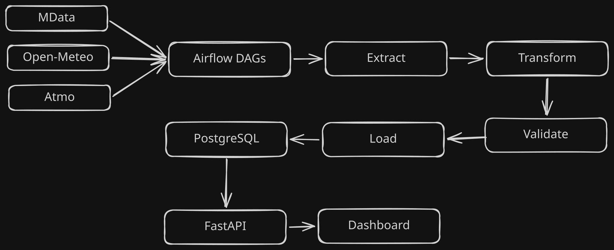

# M-Tram

**An end-to-end data engineering project for exploring Grenoble traffic alongside weather and air quality.**

M-Tram collects and archives more than 139,000 source records per day from public APIs, validates and stores them as historical time series, and exposes the data through a read-only API and an exploratory dashboard.

[Live API](https://api.m-tram.emmyvillard.fr) · [API documentation](docs/api.md) · [Dashboard documentation](docs/dashboard.md) · [Database schema](docs/schema.md) · [Data sources](docs/source.md)

## At a glance

| Area | Tools |
| --- | --- |
| Orchestration | Apache Airflow with CeleryExecutor |
| Ingestion and transformation | Python, pandas, Pydantic |
| Storage and migrations | PostgreSQL, SQLAlchemy, Alembic |
| Data access and exploration | FastAPI, Streamlit |
| Packaging and delivery | Docker Compose, GitHub Actions, pytest |

## Data pipeline

The pipeline combines three public sources:

- **MData**: Grenoble road (`trr`) and tram-line (`ligne`) traffic snapshots, collected every five minutes.
- **Open-Meteo**: hourly weather observations, loaded daily.
- **ATMO Auvergne-Rhône-Alpes**: daily air-quality and pollutant indices, loaded daily.

Each source follows an extract → transform → validate → load workflow. Airflow DAGs orchestrate the source-specific schedules and retry failed tasks. The pipeline converts API payloads into tabular records, validates them before persistence, and stores the source time series in PostgreSQL. A separate daily job prepares hourly aggregates for the API and dashboard.




## Engineering highlights

- **Data quality:** Pydantic schemas validate required fields, types, allowed values and realistic ranges. Transformations explicitly filter unusable or incomplete source records; validation failures stop the load rather than persisting invalid rows.
- **Relational modeling:** source-specific tables use timestamp-based primary keys; SQLAlchemy defines the models and Alembic tracks schema changes.
- **Orchestration:** separate Airflow DAGs handle traffic, weather, air quality and aggregate refreshes. Source DAGs retry failed tasks, and the aggregate table supports both incremental daily updates and a manual full refresh.
- **Data serving:** the FastAPI API provides record counts, read-only access to source tables and precomputed hourly aggregates. The Streamlit dashboard fetches those aggregates from the API and filters them in memory.
- **Testing and delivery:** GitHub Actions runs unit/integration tests and Airflow DAG tests on pushes. A separate workflow deploys pushes to `main` to a VPS using Docker Compose.

## API and dashboard

The API is read-only and currently provides:

- `GET /count` — row counts by dataset.
- `GET /raw/{table_name}` — raw rows from `ligne`, `trr`, `openmeteo` or `atmo`.
- `GET /aggregate/{period}` — hourly traffic and environmental aggregates for a supported period.

The dashboard compares tram or road congestion with air-quality indices and weather metrics. It supports date-range, weekday and time-of-day filters. Air-quality indices are daily values associated with the corresponding hours; the dashboard is intended for exploration, not causal inference.

See the [API guide](docs/api.md) and [dashboard guide](docs/dashboard.md) for endpoint details and behavior.

## Scope and limitations

This is a portfolio project for collecting, validating and exploring public time-series data, not a production-grade monitoring platform: it does not promise service-level guarantees, operational alerting or complete data-coverage checks. Source and aggregate DAGs run on independent schedules, so the aggregate refresh assumes that source loads have completed; that ordering is not enforced by DAG dependencies. The dashboard is exploratory, and the analysis so far has not shown a significant correlation between congestion and the environmental measures studied.

## Local demo

The demo starts PostgreSQL, the API and the dashboard in Docker, filled with **generated sample hourly aggregates** (60 days of synthetic data). It does not run Airflow or call the public APIs, so no API key is needed. Requirements: Linux, Docker with the Compose plugin, Python 3.11+.

```bash
python3 -m venv .venv
source .venv/bin/activate
source scripts/tests/run_streamlit.sh
```

Then open the dashboard at <http://localhost:8501>; the API is available at <http://localhost:8081>. The sample data is synthetic: the dashboard's correlations are only meant to show how it works, not real findings.

To stop the demo: `docker compose -f scripts/tests/docker-compose-test.yml --env-file .env.test down -v`.

## Tests

```bash
source .venv/bin/activate
source scripts/tests/setup-test-env.sh
pytest
```

## Further documentation

- [Data transformation and validation](docs/data-transformation.md)
- [Hourly aggregate design and refresh behavior](docs/dashboard-aggregate-table.md)
- [Project modules](docs/modules.md)
- [Implementation challenges](docs/challenges.md)
